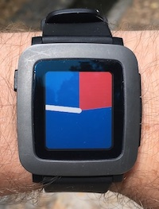
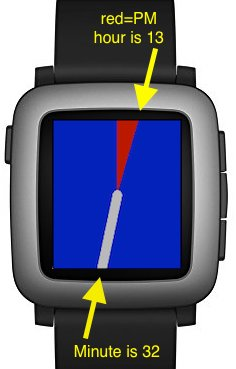

# Pie Pebble Watchface

This is is a minimalistic watchface for the Pebble smartwatch that shows the hour as a pie segment.

The background is a pie segment that goes from from 12:00 to where the hour hand of a regular watch would be. This pie segment is blue for AM (00:00-11:59) and red for PM (12:00-23:59). The minute is indicated by a white minute hand that extends from the center to the edge of the watch.

In the picture above, the watch is displaying 14:46 (2:46 PM).

To install the watchface on your Pebble, upload `pie.pbw` using the Pebble app on your smartphone, or build and install the watchface with the Pebble SDK as described on https://developer.rebble.io/developer.pebble.com/tutorials/watchface-tutorial/part1/index.html.

Planned future changes:

* Battery low indicator.
* Bluetooth down indicator.
* Configurable colors.
* Configurable width of minute hand.
* Selection of predefined color schemes.

---
*Wolfram Rösler • wolfram@roesler-ac.de • https://gitlab.com/wolframroesler • https://twitter.com/wolframroesler • https://www.linkedin.com/in/wolframroesler/*
