# Pie Pebble Watchface

This is is a minimalistic watchface for the Pebble smartwatch that shows the hour as a pie segment.

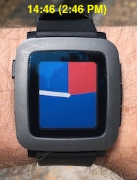
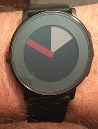

The background is a pie segment that goes from from 12:00 to where the hour hand of a regular watch would be. This pie segment is blue for AM (00:00-11:59) and red for PM (12:00-23:59). The minute is indicated by a white minute hand that extends from the center to the edge of the watch.

## How to read the time

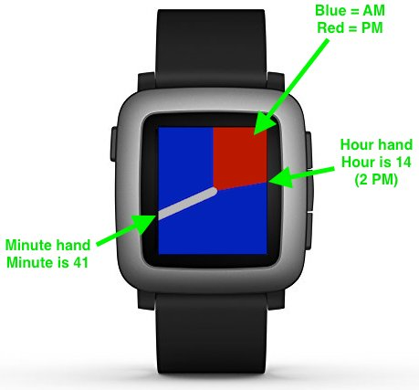

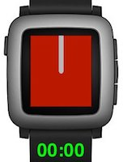
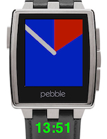
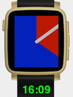
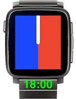
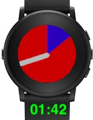

Low battery charge (≤ 10 %) is indicated by a red frame around the watch face. A disconnected Bluetooth connection to the phone is indicated by a blue frame.

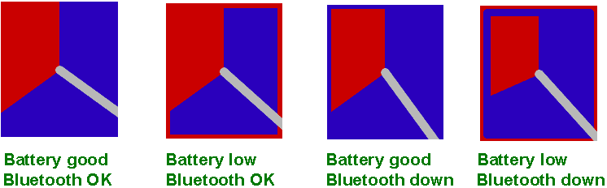

## Configuration

All colors and the widths of the minute hand, the low battery indicator, and the Bluetooth disconnect indicator are configurable through the configuration dialog on your phone. To disable the low battery/Bluetooth lost indicators, set their width to 0.

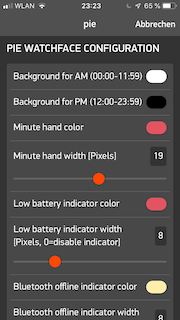

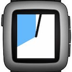
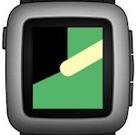
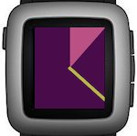
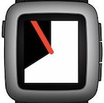
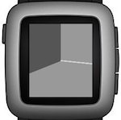

## Installation

To install the watchface on your Pebble, upload `pie-x.x.x.pbw` (x.x.x is the version number) using the Pebble app on your smartphone, or build and install the watchface with the Pebble SDK as described on https://developer.rebble.io/developer.pebble.com/tutorials/watchface-tutorial/part1/index.html.

## Development tools

* Development platform: Apple Mac Mini, Macbook Air
* Editor: gvim
* Pebble SDK: https://developer.rebble.io/developer.pebble.com/sdk/index.html
* Configuration Builder: Clay (https://developer.rebble.io/developer.pebble.com/guides/user-interfaces/app-configuration/index.html)
* Pictures in README file: macOS Preview, https://jspaint.app/

## Revision History

* 1.0.0 (2018-08-04): First release.
* 1.1.0 (2018-12-28): Add indicators for low battery and Bluetooth disconnect.

## Planned future changes

* Selection of predefined color schemes.
* Upload to Rebble store.

---
*Wolfram Rösler • wolfram@roesler-ac.de • https://gitlab.com/wolframroesler • https://twitter.com/wolframroesler • https://www.linkedin.com/in/wolframroesler/*
